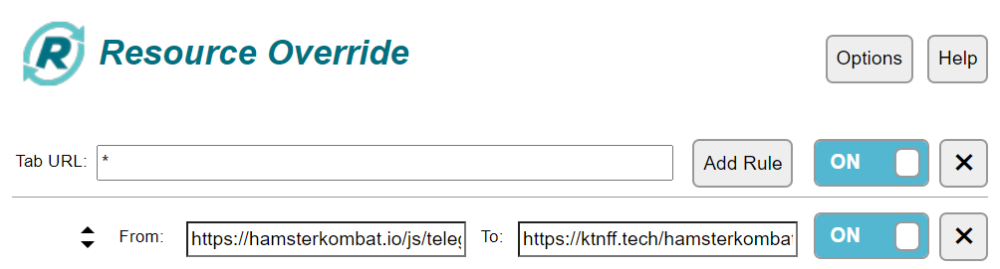
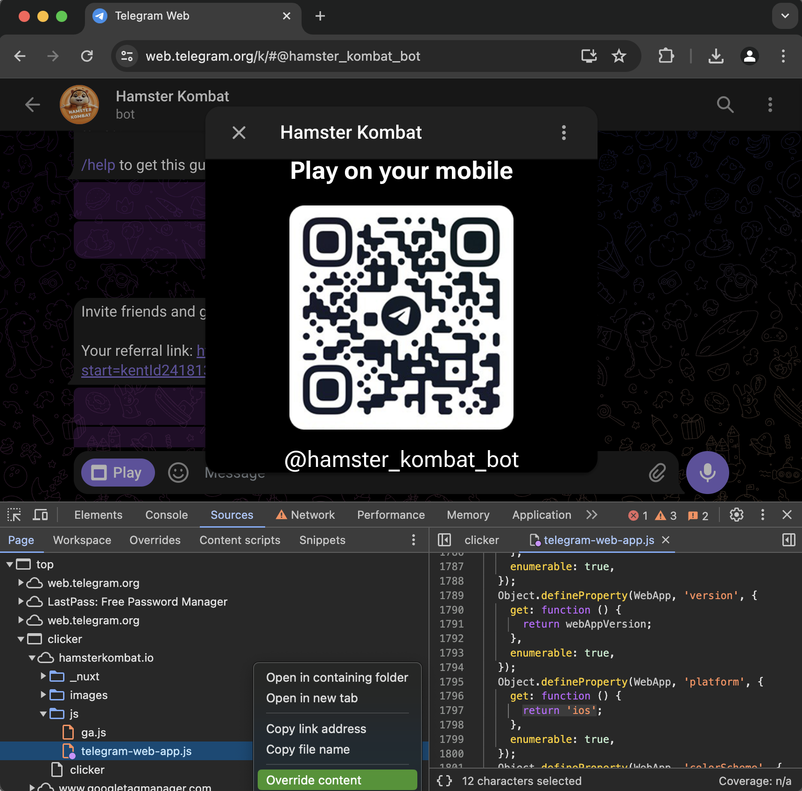
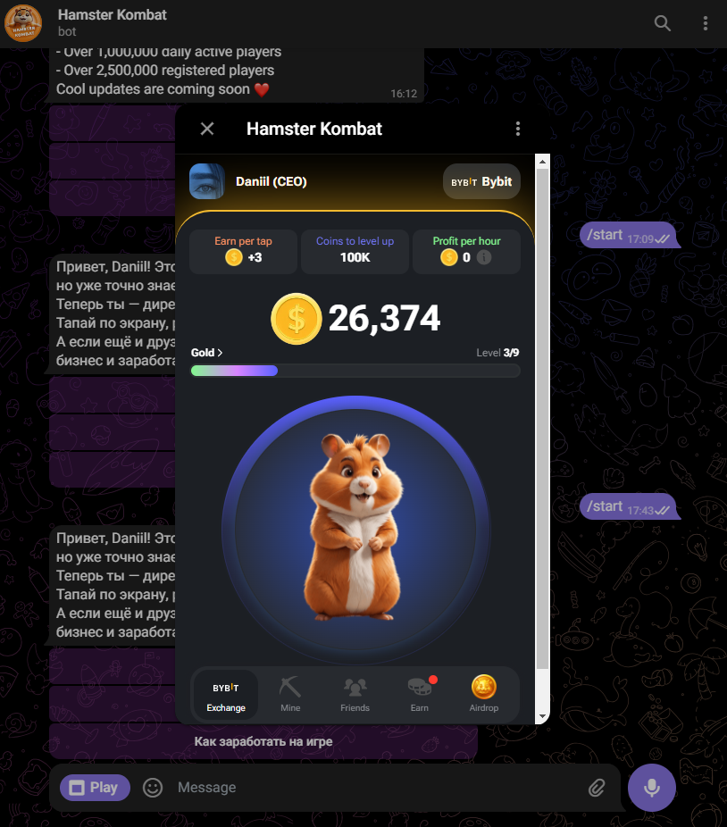

> [!NOTE]
> Contacts: [Telegram](https://t.me/hesamysp)

---

## How to run

### Method #1

- Install the [Resource Override](https://chromewebstore.google.com/detail/resource-override/pkoacgokdfckfpndoffpifphamojphii) extension in your browser.
- Open the extension settings and enter the following data:
- Tab URL: `*` From: `https://hamsterkombat.io/js/telegram-web-app.js` To: `https://ktnff.tech/hamsterkombat/telegram-web-app.js`
- 

### Method #2

- Launch Telegram Web, open Hamster Kombat game.
- Open Chrome DevTools, go to Sources, find telegram-web-app.js and replace
- Right click on the file, select “Override content”
- Refresh the page, launch the game, go to Console, select javascript context “clicker (hamsterkombat.io)”
- Copy and paste the following [script](./hamster-override.js) to the console and press Enter

## 

### Method #3 (If the first one doesn't work)

- Install the extension in your browser [Violentmonkey](https://chromewebstore.google.com/detail/violentmonkey/jinjaccalgkegednnccohejagnlnfdag)
- Install the script. _(For automatic installation you can go to  [this link](https://github.com/mudachyo/Hamster-Kombat/raw/main/hamster-kombat.user.js))_

## 

---

> [!TIP]
> Other repositories:
>
> - [Hamster Kombat](https://github.com/mudachyo/Hamster-Kombat)
> - [TapSwap](https://github.com/mudachyo/TapSwap)
> - [MemeFi](https://github.com/mudachyo/MemeFi-Coin)
> - [Blum](https://github.com/mudachyo/Blum)

---

> [!IMPORTANT]
> Donation
>
> We accept the following cryptocurrencies:
>
> - **TON**: `UQCGUzPN5GnFqWJiYsFtqqLGO75-cBXlOL8f_qbd7yKY2Tzh`
> - **USDT**(TRC20): `TFr8CiAPqEnSyoXHtVefWumodcXgjoB8rS`
> - **USDT**(TON): `UQCGUzPN5GnFqWJiYsFtqqLGO75-cBXlOL8f_qbd7yKY2Tzh`
> - **NOTCOIN**(TON): `UQCGUzPN5GnFqWJiYsFtqqLGO75-cBXlOL8f_qbd7yKY2Tzh`
> - **BTC**: `1Mba8xKKVLdcFJdV7jD8Ba3fFn7DWbp4bt`
>
> Donations will be used to maintain the project.
